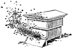

# beeswax

*Mind your own Beeswax!*

A terminal-based personal information manager inspired by [Lotus Agenda](https://en.wikipedia.org/wiki/Lotus_Agenda). It is strongly recommended that you consult the resources at Bob Newell's [Lotus Agenda Wiki](https://agenda.bobnewell.net/) to learn more. [Beeswax](https://waxandwane.org/beeswax/) organizes items into views and categories and stores everything in a single `.bwx` file that can optionally be AES-256-GCM encrypted.

There's still a huge amount of work to do, but I am now using Beeswax at both home (Linux) and the office (Windows) to do real work. I've put it here mostly so that it's easier to get on to my office laptop.

## Features

- **Items** — items live in a global pool and are assigned to one or more categories
- **Views, sections, columns** — views present filtered, sorted slices of that data in named sections; columns present additional category assignments.
- **Category Manager** — hierarchical category tree with rename, create, delete, reorder
- **View Manager** — switch view, rename, create, delete
- **Notes** — per-item notes opened in `$EDITOR` (defaults to `notepad.exe` on Windows)
- **Search** — `/` opens a search bar; Enter repeats the last query
- **Undo / Redo** — session-length undo / redo
- **Encryption** — optional AES-256-GCM file encryption with Argon2id key derivation
- **Color schemes** — eight built-in themes plus a fully custom, editable, hex-color scheme
- **Navigation modes** — Agenda (classic) or vi

## Installation

### Download a binary

Pre-compiled binaries for Linux (x86\_64, static), macOS (x86\_64 and Apple Silicon), and Windows (x86\_64) are attached to each [nightly release](../../releases/tag/nightly).

### Build from source

Requires Rust 1.85 or later (edition 2024).

```sh
git clone https://github.com/rpmohn/beeswax.git
cd beeswax
cargo build --release
# binary at target/release/beeswax
```

Or install directly into `~/.cargo/bin`:

```sh
cargo install --git https://github.com/rpmohn/beeswax.git
```

## Usage

```sh
beeswax notes.bwx              # open or create a plain file
beeswax --encrypt secrets.bwx  # open or create an encrypted file
```

When opening an encrypted file beeswax prompts for the password before entering the TUI. When creating one with `--encrypt` it prompts for a new password and confirmation.

## Key Reference

### View screen — Normal mode

| Key | Action |
|-----|--------|
| ↑ / ↓ | Move up / down |
| ← / → or Tab / Shift+Tab | Move left / right across columns |
| Ctrl+F | Open search bar |
| Home | Move to current section head (or previous section head if already there) |
| End | Move to last item in current section (or next section if already there) |
| Enter | Move down |
| F2 | Edit item text or cell value |
| F3 | Assign categories (main column) / pick value (data column) |
| F4 | Mark item done |
| F5 | Open note in `$EDITOR` |
| F6 | Item / section / column properties |
| F7 | Mark item |
| F8 | View Manager |
| F9 | Category Manager |
| F10 | Menu |
| Insert | Create new blank item below cursor |
| Delete | Remove item from section's category |
| Shift+Delete | Discard item from all categories permanently |
| Ctrl+S | Save file |
| Ctrl+Z | Undo |
| Ctrl+Y | Redo |
| Alt+Q | Quit |

### Alt commands (View screen)

| Key | Action |
|-----|--------|
| Alt+R | Add column to the right |
| Alt+L | Add column to the left |
| Alt+D | Add section below |
| Alt+U | Add section above |
| Alt+S | Sort current section now |

### vi navigation mode

Set `nav_mode = "vi"` in `config.toml` (or via F10 → Utilities → Customize) to enable. Printable keys no longer start a new item; use the bindings below instead. Arrow keys and all F-keys continue to work.

| Key | Action |
|-----|--------|
| j / k | Down / up |
| h / l | Column left / right |
| H | First visible row on screen |
| L | Last visible row on screen |
| { | Section head of current section (like Home) |
| } | Last item of current section (like End) |
| gg | First section head of the first section |
| G | Last item of the last section |
| zz | Re-centre scroll so cursor is in the middle of the screen |
| Ctrl+F | Page down |
| Ctrl+B | Page up |
| / | Open search bar |
| i | Edit current item / cell |
| o | New item below cursor |
| O | New item above cursor |
| x | Delete (remove from section category) |
| r | Redo |

## Configuration

Config file location:

| Platform | Path |
|----------|------|
| Linux / macOS | `~/.config/beeswax/config.toml` |
| Windows | `%APPDATA%\beeswax\config.toml` |

The directory is created automatically on first run if it does not exist. All settings are optional; omit any line to keep the default.

```toml
# Navigation mode: "Agenda" (default) or "vi"
nav_mode = "Agenda"

# Color scheme (see below)
colorscheme = "AgendaColor"
```

An annotated example with all options is in [`config.example.toml`](config.example.toml).

### Color schemes

| Name | Description |
|------|-------------|
| `AgendaMono` | Terminal default colors with reverse-video highlights |
| `AgendaColor` | Cyan body, blue bars, red selection — classic Lotus Agenda look |
| `GruvboxDark` | Gruvbox dark — warm cream on charcoal, teal selection |
| `GruvboxLight` | Gruvbox light — dark warm text on cream, teal selection |
| `SolarizedDark` | Solarized dark palette |
| `SolarizedLight` | Solarized light palette |
| `Dracula` | Dracula — purple-grey background, purple selection, cyan sections |
| `Custom` | User-defined hex colors (see below) |

### Custom color scheme

Set `colorscheme = "Custom"` then define any subset of the following in a `[custom_theme]` section. Omitted fields fall back to the Agenda Mono (terminal reverse-video) theme. All values are `"#rrggbb"` hex strings.

The easiest way to build a custom theme is to open F10 → Utilities → Customize, navigate to any built-in scheme, then move into the Color Settings area and edit individual fields — beeswax automatically copies the base theme into Custom on the first edit.

```toml
colorscheme = "Custom"

[custom_theme]
# Title bar, F-key bar, and menu bar
bar_fg              = "#839496"
bar_bg              = "#073642"

# Selected field / edit cursor
selected_item_fg    = "#002b36"
selected_item_bg    = "#839496"

# Selected row in the view body
view_selected_fg    = "#002b36"
view_selected_bg    = "#5e6e73"

# Modal dialog content
dialog_item         = "#839496"   # dialog body text
dialog_bg           = "#073642"   # dialog background
dialog_border_fg    = "#268bd2"
dialog_border_bg    = "#073642"
dialog_label        = "#586e75"   # unselected field label
dialog_label_sel_fg = "#2aa198"   # selected field label

# View body
view_bg             = "#002b36"   # view background
view_item           = "#839496"   # item text
view_col_entry      = "#839496"   # column value text
view_col_head       = "#2aa198"   # column header
view_sec_head       = "#2aa198"   # section header
view_head_bg        = "#002b36"   # section/column header line background
```

## File format

Beeswax files use the `.bwx` extension. The format is a short binary header followed by either plain JSON or AES-256-GCM encrypted JSON:

```
BWX\0  — 4-byte magic
u32 LE — format version
u8     — 0 = plain, 1 = encrypted
[plain JSON]  or  [32-byte salt | 12-byte nonce | ciphertext]
```

Encryption uses Argon2id to derive a 256-bit key from the password and a random salt.

## Screens

### View screen (default)

The main working area. Items are displayed under their section heads. Each view can have additional data columns to the right of the main item text.

### Category Manager (F9)

A hierarchical tree of all categories. Use arrow keys to navigate, F2 to rename, Enter to create a child, Ctrl+Arrow to reorder (move up/down, promote/demote).

### View Manager (F8)

Lists all views. Enter switches to the selected view, F2 renames inline, F4 deletes with confirmation, F6 opens the view properties dialog.

### Customize (F10 → Utilities → Customize)

Live color and navigation-mode editor. Navigate with arrow keys (or hjkl in vi mode). On any color field, press F2 or type a hex character to begin editing, Space to reset to terminal default. Selecting a built-in theme and then editing a color automatically switches to the Custom scheme with all other colors pre-filled from the chosen theme.

## License

MIT — see [LICENSE](LICENSE).
